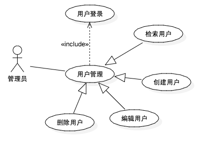
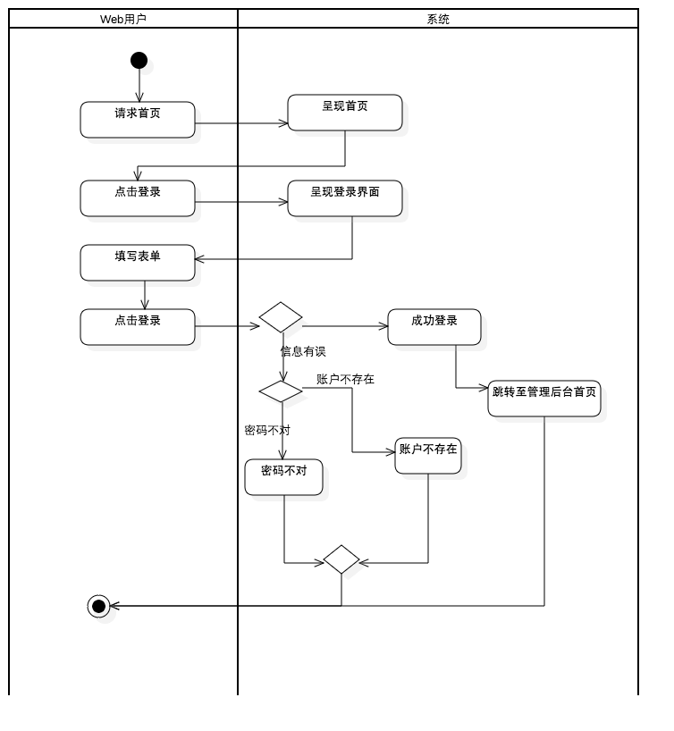

#Product Backlog#

> 待办产品需求内容，由Product Owner负责管理。所有项目利益关系人都可以添加需求，编辑需求，但无法优先级排序。
> 每次例行Product Refinement Meeting都会深化产品需求内容。在Sprint Planning Meeting中移交优先级顶端需求至Sprint Backlog。

##PBI－Product Backlog Item##

> 产品待办需求项目，一般我们采用用户故事（User Story）的方式阐述。这里我们采用Behat版本的Gherkin语法来描述用户故事。

> 用UML描述，那么用户管理是个epic，包含四个PBI。使用图例来描述PBI比较容易辨识PBI之间的关系，PBI的优先级排序往往需要考虑关系的因素。
> 用户管理的前置条件是用户登录，所以从优先级别来说用户登录必须第一个实现。

###用户登录###

> 采用UML可以描述多个场景。

    特性: 用户登录
        作为注册用户
        为了能够使用平台功能
        我要能够登录平台
    
    背景:
        存在管理员账户:
        | 用户名 | admin |
        | 邮箱 | admin@163.com |
        | 密码 | admin |

    场景: 管理员登录
        假设在首页
        当点击登录
        那么应该在登录界面
        当在表单中填入
        | 账号 | admin |
        | 密码 | admin |
        并点击登录
        那么应该成功登录
        并且管理后台首页
        

    场景: 密码不正确
    
    场景: 不存在账号

###用户管理###

> 采用Behat的Gherkin描述，每个步骤都非常严谨，如果一个场景非常简单或者非常常用，那么可以采用Acceptance Criteria的方式描述。
> 如果要采用BDD驱动模式开发，那么必须遵循Gherkin描述。

**提醒：** Behat的中文需要完善，此工作正在进行中。

    特性: 用户管理
        作为管理员
        为了能够管理平台用户
        我要能够创建，编辑，检索，删除用户

    背景:
        假设以管理员身份登录

    场景: 创建用户
        假设在管理后台首页
        点击创建用户
        那么应该在创建用户页面
        当在表单中填入
        | 用户名 | kendoctor |
        | 邮箱 | kendoctor@163.com |
        | 密码 | 123456    |
        | 重复密码 | 123456    |
        并且点击提交
        那么应该在检索用户页面
        并且应该看到2条记录
        用户名、邮箱都唯一
        
        

    场景: 检索用户
        假设在管理后台首页
        点击用户管理
        那么应该看到1条记录
        假设由21个用户
        那么应该看到翻页功能
        

    场景: 编辑用户
        密码无须编辑
        如果修改了用户名和邮箱，完成后自动退出。
        
        
    场景: 重置密码
        如果是当前账户，修改后自动退出
        
    
    场景: 删除用户
        删除用户时需要提示用户确认
        如果用户有关联内容无法删除
        

###角色管理###

###用户组管理###

