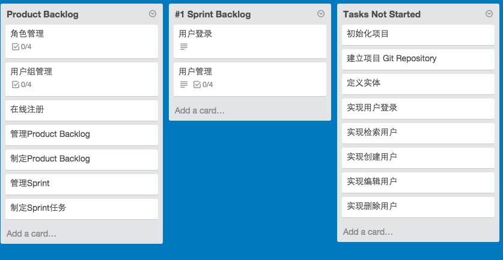

#第一期Sprint#

> 例行Sprint Planning Meeting，团队从Product Backlog顶端抽取PBI至Sprint Backlog，根据团队能力评估是否可以在Spring期限内完成抽取的PBI。
> 制定初始化任务，当会议结束后，Sprint正式开始执行。开发团队各自领取任务，实现任务内容，完成任务后，提交完成内容，把任务移至完成列表。

##Sprint Backlog Item##

 1. 用户登录
 2. 管理

##任务##

###开发环境搭建和项目初始化###

> 项目第一次实行开发实施，第一步，建立项目

 symfony new scrum-agile
 
> 对项目进行版本控制

 git init
 

> Symfony项目搭建需要考虑的必要元素，

> 1. Data Fixtures : 样例数据可以用于测试，以及快速实现逻辑流程提供必要数据，构建系统的初始数据。
> 2. Migrations : 迭代开发的项目基本需求会不断的深化，系统数据结构会不断更新，那么数据迁徙必然需要考虑。
> 3. PHPUnit : 对于关键性逻辑进行单元测试、功能性测试，可采用BDD技术

###实现用户以及安全特性###

> 采用FOSUserBundle可以快捷搭建用户以及安全功能

