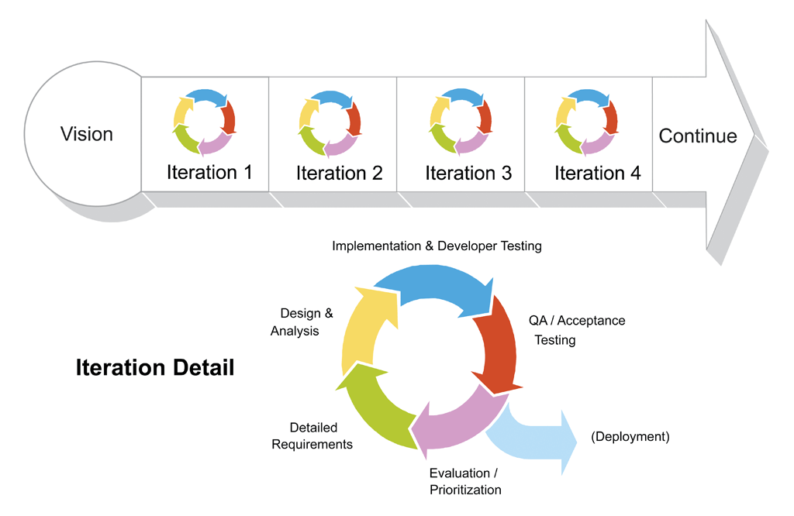

#第一期Sprint#

> 例行Sprint Planning Meeting，团队从Product Backlog顶端抽取PBI至Sprint Backlog，根据团队能力评估是否可以在Spring期限内完成抽取的PBI。
> 制定初始化任务，当会议结束后，Sprint正式开始执行。开发团队各自领取任务，实现任务内容，完成任务后，提交完成内容，把任务移至完成列表。

##Sprint Backlog Item##

 1. 用户登录
 2. 管理

##任务##

###开发环境搭建和项目初始化###

> 项目第一次实行开发实施，第一步，建立项目

    symfony new scrum-agile
 
> 对项目进行版本控制

    git init
 

> Symfony项目搭建需要考虑的必要元素，

> 1. Data Fixtures : 样例数据可以用于测试，以及快速实现逻辑流程提供必要数据，构建系统的初始数据。
> 2. Migrations : 迭代开发的项目基本需求会不断的深化，系统数据结构会不断更新，那么数据迁徙必然需要考虑。
> 3. PHPUnit : 对于关键性逻辑进行单元测试、功能性测试，可采用BDD技术

###实现用户以及安全特性###

> 采用FOSUserBundle可以快捷搭建用户以及安全功能

###页面制作###

> 采用bower来安装关联的页面制作模块、组建和JS类库，采用Grunt来搭建调试环境和输出最终发布版本
> 页面需要由专属人员独立完成，包括交互，样式编写，设计整合
> 页面先设计还是功能逻辑先完成？如果要同步，那么沟通非常重要，除了沟通，一定要把想法和思路文档化。

###实现用户登录###

> 实现步骤如下:

>  * 安装FOSUserBundle
>  * 定义User实体类并继承FOSUser提供的User类,根据不同数据库驱动类型，此处采用Doctrine
>  * 配置config.yml和security.yml
>  * 更新数据 ``doctrine:schema:update --force``，如果没有创建数据库，先创建
>  * 引入路由
>  * 默认登录地址为 localhost://app_dev.php/login
>  * 调整和美化模版
>  * 如果要自定义登录逻辑，两种方法，完全重写，或者继承FOSUserBundle，建议前者，比较自由。
>  * 登录后页面导向问题，可采用替换handler来完成

    main:
        pattern: ^/
        form_login:
            provider: fos_userbundle
            csrf_provider: security.csrf.token_manager
            success_handler: kendoctor.security.handler.login_success

###建立初始管理账户###

> 实现步骤如下:

> * 安装DoctrineFixturesBundle
> * 在XXXBundle目录下创建DataFixtures/ORM目录，此处用的ORM驱动，其他驱动，用其他名称。

    class LoadUserData extends AbstractFixture implements ContainerAwareInterface, OrderedFixtureInterface
    {
      ...
    }
    
> * 如果需要服务，可以实现``ContainerAwareInterface``
> * 执行命令 ``doctrine:fixtures:load`` 载入初始数据

###实现用户管理###

> 实现步骤如下:

> * 定义路由
> * 创建表单
> * 创建控制器 ``UserController``,，为了更好的组织代码结构，后台管理的归类在``Controller/Admin``目录下；
对应的页面模版也是如此,``views/Admin/User/index.html.twig``。
> * 如何代码变得更加优质，那是需要一步步完善的，
初期来讲，可以把处理一个实体类的逻辑都放入对应的一个管理器，譬如User由UserManager来负责其关联逻辑。
把``UserManager``注册为服务，这样可比较灵活的在任何处使用。
> * 完成各个路由的逻辑
> * 完成各个页面的输出，如果需要JS交互功能，一般由负责页面制作者独立完成，然后整合进来。
> * 进行多语种翻译处理，如果需要支持多语种的话。
> * 美化页面，美化往往放到最后，一个程序首先逻辑要正确，然后是易用性，然后是美化。

   

